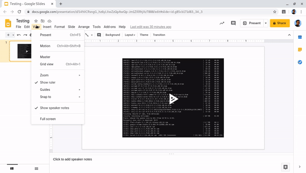

# Google Slides asciinema
[](https://opensource.org/licenses/Apache-2.0)

<div>
    
</div>

Have you ever work with [asciienma](https://asciinema.org/)? It's an amazing
tool for creating tutorials or avoiding the "demo effect" when you are doing
presentations.

[asciinema allows to embed the animations in different places
like websites](https://asciinema.org/docs/embedding). With Javascript, you
can integrate those animations easily in tools like
[revealjs](https://revealjs.com/) but there is not a way to integrate those
animations with [Google Slides](https://www.google.com/slides/about/)...

## ... and this Chrome extension was born!


## How to install it

You have to follow these steps:

1. Clone this repository
2. Type `chrome://extensions` in your Chrome browser
3. Enable the "`Developer mode`" by clicking the toggle switch
4. Click "`LOAD UNPACKED`" and search the folder where this repository was
cloned. Then, open the `chrome_extension` folder.
5. The extension is ready to use!

## How to use the extension

After enabling it, all you have to do is creating draw circle, rectangle or
add an image to your slides. Then, add a link to the desired asciinema
animation website. For instance:
[https://asciinema.org/a/14](https://asciinema.org/a/14)

Remember that, if you add `.png` to that URL, you will get a preview for the
asciinema animation. For the previous example, it would be
[https://asciinema.org/a/14.png](https://asciinema.org/a/14.png). So, you can
include that image in your Google slides and add the link to the asciinema
animation: if the Chrome extension is installed, you will see the animation
totally embedded in your slides. If not, you'll have a preview linked with the
real animation (and that works too for PDF :wink:).


## License
This project is licensed under the [Apache 2.0 license](LICENSE).

```
Licensed to the Apache Software Foundation (ASF) under one
or more contributor license agreements.  See the NOTICE file
distributed with this work for additional information
regarding copyright ownership.  The ASF licenses this file
to you under the Apache License, Version 2.0 (the
"License"); you may not use this file except in compliance
with the License.  You may obtain a copy of the License at

  http://www.apache.org/licenses/LICENSE-2.0

Unless required by applicable law or agreed to in writing,
software distributed under the License is distributed on an
"AS IS" BASIS, WITHOUT WARRANTIES OR CONDITIONS OF ANY
KIND, either express or implied.  See the License for the
specific language governing permissions and limitations
under the License.
```